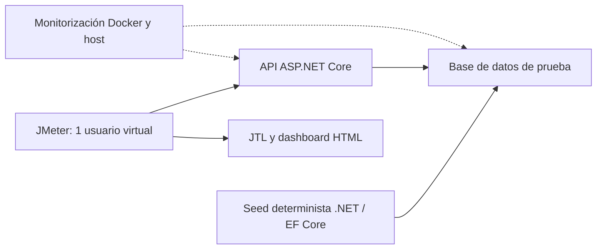

# Plan de pruebas de volumen con Apache JMeter

## 1. Propósito

Definir dos pruebas no funcionales automatizables para medir cómo cambia el comportamiento de la API cuando aumenta la cantidad de datos almacenados: un catálogo creciente y un historial creciente de ventas para reportes.

El documento sigue la estructura del [plan de rendimiento](PLAN_PRUEBAS_RENDIMIENTO_JMETER.md) y utiliza los endpoints de [API.md](../API.md), el [mapeo Swagger → tests](../test_endpoints/SWAGGER_TESTS_MAPPING.md) y la implementación actual de los controladores de productos y reportes.

> Los volúmenes y umbrales son propuestas iniciales, no resultados medidos. VOL-01 dispone de [implementación e instrucciones](../../tests/ElohimShop.Tests/performance/volume/README.md). VOL-02 sigue pendiente. No se ha medido la capacidad del backend real.

## 2. Objetivos

1. Medir tiempos de respuesta al aumentar los registros del tenant evaluado.
2. Identificar el mayor volumen probado que cumple los límites acordados.
3. Verificar que el crecimiento no cause respuestas incompletas, duplicados ni cálculos incorrectos.
4. Medir CPU, RAM, almacenamiento y tamaño de respuesta por nivel.
5. Producir ejecuciones repetibles y comparables, manteniendo constante la concurrencia.

## 3. Alcance

### Incluido

| Endpoint | Uso |
|---|---|
| `GET /api/v1/productos` | Medir listado de un catálogo creciente |
| `GET /api/v1/productos/{id}` | Medir consulta individual sobre el mismo catálogo |
| `GET /api/v1/reportes/productos` | Medir agregación de un historial creciente de ventas |
| `POST /api/v1/productos/bulk` | Alternativa para preparar catálogo; fuera de la medición formal |
| `POST /api/v1/auth/login` o `/google` | Preparar autenticación, según el flujo disponible |

### Excluido inicialmente

- Incremento de usuarios concurrentes.
- Pruebas de archivos o cuerpos HTTP gigantes.
- Pagos reales, Stripe, Cloudinary, correos y webhooks.
- Medición del rendimiento del proceso de importación.
- Cambios de índices, código o límites de contenedores entre niveles de una misma serie.

El mapeo contiene rutas anteriores para reportes. Se utiliza `GET /api/v1/reportes/productos`, presente en `API.md` y en el controlador actual.

## 4. Qué significa volumen en estas pruebas

| Tipo de prueba | Variable que se modifica | Ejemplo |
|---|---|---|
| Carga | Concurrencia o tráfico esperado | 50 usuarios consultando un catálogo fijo |
| Estrés | Demanda creciente hasta degradación | Incrementar usuarios hasta superar la capacidad |
| Volumen | Cantidad de datos procesados o almacenados | Consultar con 1 000, 10 000 y 100 000 productos |

En este plan se mantiene **un usuario virtual**, con solicitudes secuenciales y pausa fija. El volumen se prepara antes de medir. Los tiempos de generación e importación se registran por separado y no se mezclan con la latencia de consulta.

Un hilo con pausa fija no produce una tasa de solicitudes constante: si la respuesta tarda más, disminuye el throughput. Debe registrarse esa diferencia sin aumentar hilos para compensarla.

## 5. Herramienta y arquitectura sugeridas

**Herramienta principal: Apache JMeter.** Permite ejecutar solicitudes HTTP, comprobar respuestas y guardar muestras para comparar niveles. Las mediciones formales se realizarán en [modo CLI](https://jmeter.apache.org/usermanual/get-started.html), con resultados `.jtl` y un [dashboard HTML](https://jmeter.apache.org/usermanual/generating-dashboard.html).

**Apoyo para preparar datos:** VOL-01 incluye `catalog-prepare.jmx`, que lee `performance/data/volume.csv`, crea productos por API y asigna inventarios a dos sucursales usando componentes nativos de JMeter. Para VOL-02 se propone un comando de seed en .NET/EF Core, a implementar para la base de datos de pruebas. Se propone usar los modelos del backend para conservar relaciones y tipos. El seed es una fase independiente de JMeter.



Puede iniciarse en Docker local. Registrar recursos de JMeter y del host para distinguir límites del servidor de límites del generador. Para comparaciones más confiables, ejecutar JMeter en otro equipo.

## 6. Preparación de datos

### Reglas comunes

- Usar una base aislada y un tenant de pruebas, sin información real.
- Generar datos con una semilla fija y un manifiesto por nivel.
- Registrar número de filas por entidad, tamaño de tablas e índices, tenant, semilla y fecha de generación.
- Mantener iguales la longitud y distribución de textos, precios, relaciones y fechas entre niveles.
- Conservar un tenant de control pequeño con datos distinguibles para detectar mezcla accidental de resultados.
- Preparar snapshots por nivel o reconstruir el conjunto desde cero. No acumular registros sin comprobar el total real.
- Detener el seed antes de medir y esperar a que finalicen operaciones de fondo relevantes de la base.
- Aplicar la misma política de actualización de estadísticas del motor en todos los niveles y documentarla.

### Catálogo

Crear nombres y SKU únicos y deterministas, categorías válidas y una cantidad fija de relaciones por producto; por ejemplo, dos registros de inventario por producto asociados a dos sucursales. Mantener constante la proporción de publicación y las longitudes de descripción. Las imágenes serán URLs de prueba, sin subir archivos.

El volumen se expresa como **productos del tenant objetivo**, acompañado del conteo de inventarios. El número total de filas de la base será mayor.

### Historial de ventas

Preparar ventas y sus detalles con relaciones válidas a productos, empleados y tenant, conforme al modelo de persistencia actual. Mantener un catálogo fijo de 1 000 productos, con nombres únicos, y cinco líneas por venta. Distribuir las ventas en el mismo intervalo fijo de 12 meses en todos los niveles.

El seed debe respetar estados y fechas que la consulta de reportes considera elegibles. No generar transacciones mediante cobros reales. Calcular totales esperados desde los datos sintéticos de entrada, sin reutilizar la implementación del servicio de reportes como oráculo.

## 7. Métricas

| Métrica | Fuente | Uso |
|---|---|---|
| Registros del tenant y filas relacionadas | Manifiesto y conteos de base de datos | Variable independiente |
| Tamaño de tablas e índices | Herramientas del motor de base de datos | Crecimiento del almacenamiento |
| Promedio, p95 y máximo de respuesta | JMeter, por sampler | Degradación de consultas |
| Solicitudes, errores y timeouts | JMeter | Confiabilidad y suficiencia de la muestra |
| Bytes recibidos por solicitud | JMeter | Crecimiento de transferencia HTTP |
| Tamaño del JSON sin compresión | Verificación separada | Volumen lógico de respuesta |
| CPU y RAM promedio y pico | Docker y host | Consumo y presión de memoria |
| CPU y heap de JMeter | JVM y host | Identificar saturación del generador |
| Latencia y actividad de disco | Herramientas del host o del motor | Posibles límites de almacenamiento |
| Exactitud de conteos y agregados | Aserciones y manifiesto | Integridad funcional |

Mantener constante la compresión HTTP. Los bytes de transporte y el tamaño del JSON descomprimido no son necesariamente iguales.

## 8. Protocolo común de ejecución

1. Registrar commit, versiones, hardware, configuración y límites Docker.
2. Restaurar o generar el nivel de datos seleccionado.
3. Verificar conteos, relaciones y valores esperados fuera de la ventana de medición.
4. Preparar tenant y autenticación. El token debe permanecer válido durante la ejecución.
5. Medir tres minutos en reposo para obtener el baseline de recursos de ese nivel.
6. Ejecutar 10 iteraciones de calentamiento, excluidas del `.jtl` formal.
7. Ejecutar 200 iteraciones medidas por escenario, con un hilo y pausa de un segundo entre iteraciones.
8. Registrar recursos del backend, base, host y generador durante toda la medición.
9. Verificar nuevamente integridad y observar tres minutos de recuperación.
10. Repetir tres veces por nivel con el mismo snapshot y procedimiento de calentamiento.
11. Continuar al siguiente nivel solo si el ambiente conserva margen operativo.

La serie principal representa consultas con cachés calentadas. Si se desea evaluar arranque en frío, crear otra serie con un protocolo explícito y comparable; no mezclar ambos tipos de muestras. Las 200 muestras permiten un p95 inicial, pero no justifican conclusiones robustas sobre p99.

## 9. VOL-01 — Catálogo creciente

### Qué se quiere hacer

Medir el efecto del número de productos sobre el listado completo y sobre una consulta individual.

### Particularidad de la implementación actual

Aunque `API.md` menciona paginación y filtros, `ProductosV1Controller.Listar` no recibe parámetros de página y el servicio devuelve una lista. No añadir `page` o `pageSize` suponiendo que limitan resultados. Confirmar el contrato de la versión desplegada antes de implementar.

El listado incluye datos de inventario: tanto la cantidad de productos como sus relaciones afectan el tamaño de respuesta. Si posteriormente se incorpora paginación, debe abrirse una serie nueva de mediciones.

### Niveles propuestos

| Nivel | Productos del tenant | Inventarios (dos sucursales) | Usuarios | Iteraciones por corrida | GET listado / detalle | Repeticiones |
|---|---:|---:|---:|---:|---|---:|
| V1 | 1 000 | 2 000 | 1 | 200 | 200 / 200 | 3 |
| V2 | 10 000 | 20 000 | 1 | 200 | 200 / 200 | 3 |
| V3 | 50 000 | 100 000 | 1 | 200 | 200 / 200 | 3 |
| V4 | 100 000 | 200 000 | 1 | 200 | 200 / 200 | 3 |

Cada corrida genera **400 solicitudes medidas**: 200 listados completos y 200 detalles. Antes se ejecutan 10 iteraciones de calentamiento (20 solicitudes), excluidas de la medición. La pausa de un segundo ocurre después del par listado/detalle. Las verificaciones previas y posteriores tampoco se incluyen en el `.jtl` formal.

Los niveles son objetivos de ensayo. Si el equipo no puede prepararlos o procesarlos, registrar el límite observado sin afirmar que se ejecutaron los superiores.

### Flujo de cada iteración

1. Enviar `GET /api/v1/productos` con el tenant requerido.
2. Comprobar `200`, JSON válido y conteo de productos igual al manifiesto.
3. Seleccionar al azar un ID del listado mediante JSON Extractor nativo. Los IDs pueden repetirse entre iteraciones; el CSV contiene la configuración del escenario.
4. Enviar `GET /api/v1/productos/{id}`.
5. Comprobar `200`, ID, tenant y valores conocidos del producto.
6. Esperar un segundo antes de repetir.

Registrar listado y detalle con etiquetas distintas; no calcular un único p95 que mezcle ambos. La implementación nativa valida conteo, tenant y unicidad del ID muestreado; la validación exhaustiva de todos los IDs antes y después de la ventana formal queda como comprobación adicional en la base de datos. No concluir integridad exhaustiva solo porque pasaron las aserciones del muestreo. Evitar conservar cuerpos completos de gran tamaño en listeners o archivos de resultados.

### Criterios de aceptación iniciales

| Criterio | Umbral propuesto por nivel |
|---|---:|
| p95 del listado | ≤ 2 000 ms |
| p95 de detalle | ≤ 1 000 ms |
| Errores HTTP, timeouts o aserciones fallidas | 0 |
| Productos omitidos, duplicados o de otro tenant | 0 |
| Reinicios de contenedores o terminaciones por memoria | 0 |

Los umbrales deben acordarse antes de medir. Un listado completo que los incumple revela una limitación del endpoint para ese volumen, aunque las consultas individuales sigan siendo rápidas.

### Cómo declarar el resultado

> VOL-01 cumplió hasta **___ productos**, con **___ filas de inventario**, p95 de listado de **___ ms**, p95 de detalle de **___ ms** y respuesta de **___ MiB**. El primer nivel que incumplió fue **___**, debido a **___**.

## 10. VOL-02 — Reporte con historial creciente de ventas

### Qué se quiere hacer

Medir `GET /api/v1/reportes/productos` cuando crece el historial almacenado y verificar que los totales sigan siendo correctos.

### Niveles propuestos

| Nivel | Ventas del tenant | Líneas de detalle, cinco por venta | Productos del catálogo |
|---|---:|---:|---:|
| H1 | 1 000 | 5 000 | 1 000 |
| H2 | 10 000 | 50 000 | 1 000 |
| H3 | 50 000 | 250 000 | 1 000 |
| H4 | 100 000 | 500 000 | 1 000 |

El crecimiento se concentra en el historial; mantener constantes catálogo, empleados y reglas de distribución. La agrupación actual se realiza por nombre de producto, por lo que se usan nombres únicos para que el oráculo sea inequívoco.

### Escenarios por nivel

| Escenario | Parámetros | Qué permite observar |
|---|---|---|
| R1 — Mes fijo | `desde`, `hasta` para el mismo mes y `modo=ventas` | Consulta acotada con una base creciente |
| R2 — Año fijo | `desde`, `hasta` para los mismos 12 meses y `modo=ventas` | Agregación de un conjunto mayor |

Fijar fechas absolutas, zona horaria y semántica de los límites según el contrato. Evitar usar “hoy menos 30 días”, porque cambia el conjunto entre ejecuciones. Registrar cuántas ventas y líneas corresponden realmente a cada intervalo.

### Flujo de cada iteración

1. Enviar el reporte con token de staff autorizado y tenant de prueba.
2. Comprobar `200` y estructura del DTO de respuesta.
3. Comparar total de unidades, ingresos y productos agrupados contra el manifiesto del intervalo.
4. Verificar producto más vendido y unidades; preparar datos con un ganador único.
5. Esperar un segundo.

Ejecutar R1 y R2 por separado, cada uno con 200 iteraciones y tres repeticiones. Usar aritmética decimal y las reglas de redondeo documentadas al comparar dinero. Revisar los nombres JSON reales del DTO al construir las aserciones.

### Criterios de aceptación iniciales

| Criterio | Umbral propuesto por nivel |
|---|---:|
| p95 de R1, mes fijo | ≤ 2 000 ms |
| p95 de R2, año fijo | ≤ 5 000 ms |
| Errores HTTP, timeouts o aserciones fallidas | 0 |
| Diferencias en unidades e ingresos esperados | 0 |
| Registros ajenos al tenant en el reporte | 0 |
| Reinicios o terminaciones por memoria | 0 |

### Cómo declarar el resultado

> VOL-02 cumplió hasta **___ ventas y ___ líneas**. El reporte mensual procesó **___ líneas** con p95 de **___ ms**, y el anual **___ líneas** con p95 de **___ ms**. Los totales **coincidieron/no coincidieron** con el manifiesto.

## 11. Recursos y deltas

Calcular para cada nivel:

```text
Delta CPU = CPU promedio durante medición − CPU promedio en reposo del mismo nivel
Delta RAM = RAM promedio durante medición − RAM promedio en reposo del mismo nivel
Factor de latencia = p95 del nivel actual / p95 del nivel inicial
```

Expresar el delta de CPU en puntos porcentuales. Registrar RAM absoluta y pico además del delta: las cachés o el conjunto de datos pueden elevar el consumo antes de iniciar la medición.

No confundir correlación con causa. Un crecimiento de RAM puede provenir de materialización de datos, serialización, caché o del generador. La CPU Docker puede superar 100 % si se utilizan varios núcleos.

## 12. Protección del ambiente y condiciones de parada

- Confirmar espacio disponible antes de cada seed, incluyendo índices, logs del motor, snapshots y reportes.
- Detener preparación o ejecución si el disco libre queda por debajo de 20 % o de la reserva mínima definida para el equipo.
- Detener si la RAM del host supera 85 % durante 30 segundos, aparece swap sostenida o un contenedor termina por memoria.
- Detener ante tres timeouts consecutivos, reinicios o pérdida de integridad.
- Configurar timeout de conexión de 5 segundos y de respuesta de 30 segundos como valores iniciales.
- Si JMeter agota heap o el host se satura, clasificar el resultado como limitado por el ambiente; no atribuir automáticamente el límite a la API.

Estas condiciones deben implementarse en el script supervisor o aplicarse manualmente; JMeter no vigila automáticamente el disco y la RAM de todos los contenedores.

## 13. Estructura de la implementación de VOL-01

```text
backend/tests/ElohimShop.Tests/performance/
├── data/
│   ├── volume.example.csv
│   ├── volume.csv               # configuración local, no versionada
│   └── users.csv                # credenciales locales para preparación
├── volume/
│   ├── README.md
│   ├── catalog-prepare.jmx
│   └── catalog-volume.jmx
├── results/volume/
└── reports/volume/
```

`volume.csv` contiene una fila con `tenant_id,product_count,iterations,branch_a,branch_b`. El contador nativo genera los nombres y SKU, sin un generador Python. El preparador exige catálogo vacío, valida ambas sucursales, crea productos y comprueba el conteo final. No borra datos automáticamente. Los reportes históricos VOL-02 siguen pendientes de implementación.

## 14. Componentes esperados en JMeter

- Thread Group: un hilo y 200 iteraciones medidas.
- HTTP Request Defaults: protocolo, host, puerto y timeouts configurables.
- HTTP Header Manager: tenant y token cuando corresponda.
- HTTP Request por endpoint, con etiquetas independientes.
- [CSV Data Set Config](https://jmeter.apache.org/usermanual/component_reference.html#CSV_Data_Set_Config) para leer tenant, volumen, iteraciones y sucursales desde `performance/data/volume.csv`; JSON Extractor para seleccionar IDs del listado.
- Response Assertions para códigos y JSON JMESPath Assertions nativas para validar JSON y valores esperados, sin Groovy.
- Flow Control Action para pausar después del par de consultas, sin añadir muestras HTTP.
- Calentamiento separado de resultados formales.
- Sin listeners de cuerpos completos durante la medición.

El procesamiento de aserciones grandes consume recursos de JMeter, aunque no represente tiempo de servicio del endpoint. Medir el generador y mantener iguales las verificaciones entre niveles.

## 15. Ejecución y obtención de resultados

Seguir el [README de volumen](../../tests/ElohimShop.Tests/performance/volume/README.md) para copiar y editar los CSV, preparar una sola vez con `catalog-prepare.jmx` y ejecutar tres corridas por nivel.

Ejemplo de medición desde `backend/tests/ElohimShop.Tests/performance/`, una vez preparados y verificados los datos:

```bash
mkdir -p results/volume/V1-run1 reports/volume
jmeter -n -t volume/catalog-volume.jmx \
  -Jvolume_file="$PWD/data/volume.csv" \
  -l results/volume/V1-run1/results.jtl \
  -j results/volume/V1-run1/jmeter.log \
  -e -o reports/volume/V1-run1
```

El calentamiento se ejecuta antes en otra invocación del mismo plan con `-Jiterations=10` y archivos distintos. El CSV establece 200 iteraciones para la medición formal. Cambiar el nombre de salida para cada repetición; no reutilizar archivos `.jtl` ni directorios HTML existentes.

Para observación inicial del ambiente:

```bash
docker stats
vmstat 5
df -h
```

Registrar baseline y recuperación, además de métricas durante la medición, mediante los scripts existentes de rendimiento o herramientas del host. Los `.jmx` no monitorizan recursos ni implementan paradas por presión de memoria. Consultar tamaño de tablas e índices fuera de la medición HTTP.

## 16. Registro de resultados

### Contexto

| Ejecución | Commit | Hardware y límites Docker | Motor y versión DB | Semilla | Caché | Fecha |
|---|---|---|---|---|---|---|
| 1 | | | | | Calentada | |

### VOL-01

| Nivel | Productos reales | Tamaño DB | Listado p95 | Detalle p95 | JSON listado MiB | Errores | Pico RAM API | Pico RAM JMeter | Resultado |
|---|---:|---:|---:|---:|---:|---:|---:|---:|---|
| V1 | | | | | | | | | Pendiente |
| V2 | | | | | | | | | Pendiente |
| V3 | | | | | | | | | Pendiente |
| V4 | | | | | | | | | Pendiente |

### VOL-02

| Nivel | Ventas / líneas reales | Líneas R1 / R2 | p95 R1 | p95 R2 | Totales correctos | Pico RAM API / DB | Errores | Resultado |
|---|---|---|---:|---:|---|---|---:|---|
| H1 | | | | | | | | Pendiente |
| H2 | | | | | | | | Pendiente |
| H3 | | | | | | | | Pendiente |
| H4 | | | | | | | | Pendiente |

Guardar las tres repeticiones individualmente y resumir la mediana de sus p95 para comparación. No ocultar una repetición fallida mediante el promedio o la mediana: el nivel solo pasa si las tres cumplen todos los criterios.

## 17. Automatización y frecuencia

| Prueba | Frecuencia propuesta | Preparación |
|---|---|---|
| VOL-01 | Antes de una entrega o al cambiar catálogo, consultas e índices | Snapshot V1–V4 |
| VOL-02 | Antes de una entrega o al cambiar reportes y persistencia de ventas | Snapshot H1–H4 |

El flujo automatizado sería: preparar nivel → validar manifiesto → medir reposo → calentar → ejecutar JMeter y monitorización → comprobar integridad → evaluar umbrales → publicar artefactos → restaurar entorno.

En la implementación nativa de VOL-01, revisar p95, errores y conteo de muestras en el dashboard. La evaluación automática de umbrales en CI queda pendiente; no se agrega un evaluador Python. Que JMeter termine y genere HTML no significa que los criterios de rendimiento hayan pasado. Los fallos de preparación se reportan como `INCONCLUSO`, nunca como aprobados.

## 18. Reglas para interpretar los resultados y entregables

- Comparar niveles con iguales recursos, índices, consultas, distribución y política de caché.
- Distinguir registros almacenados, registros seleccionados y filas devueltas: un reporte agregado puede devolver pocos productos después de procesar miles de líneas.
- Si el tamaño de respuesta crece con el catálogo, analizar transferencia y serialización además de la base de datos.
- El mayor nivel aprobado es el mayor **probado**, no una capacidad máxima universal.
- Si todos pasan, informar que no se encontró el límite dentro del rango ensayado.
- Los errores por tenant, credenciales o datos inválidos deben corregirse antes de concluir sobre volumen.

Entregar por ejecución los `.jmx`, manifiesto y semilla, `.jtl`, dashboard HTML, métricas de recursos, conteos de integridad, configuración del ambiente y tablas completas. Conservar evidencia de niveles omitidos o detenidos y su motivo.

## 19. Conclusión esperada del estudio

> Con **___ productos y ___ registros relacionados**, la API **cumplió/no cumplió** los límites de listado y detalle. El listado transfirió **___ MiB**, obtuvo p95 de **___ ms** y utilizó un pico de **___ MiB de RAM** en el backend.

> Con **___ ventas y ___ líneas de detalle**, el reporte mensual obtuvo p95 de **___ ms** y el anual de **___ ms**. Los resultados **coincidieron/no coincidieron** con los valores esperados. El primer nivel que incumplió fue **___**, o no se encontró incumplimiento hasta **___**.

---

**Herramienta principal:** Apache JMeter.  
**Preparación:** JMeter nativo y CSV por API para VOL-01; seed .NET/EF Core propuesto para VOL-02; snapshots de prueba por nivel.  
**Variable principal:** cantidad de datos; concurrencia fija de un usuario.  
**Estado:** VOL-01 implementado con JMeter 5.6.3, Java 26.0.2.1 y CSV, sin Python ni Groovy; medición real pendiente. VOL-02 pendiente de implementación.
