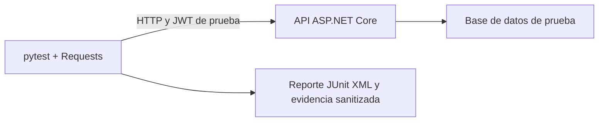

# Plan de pruebas de seguridad automatizadas para la API

## 1. Propósito

Definir dos pruebas de seguridad automatizables para comprobar el aislamiento de clientes y tiendas, la validación de tokens y las restricciones de acceso a funciones administrativas de la API.

El documento sigue la organización del [plan de rendimiento con JMeter](../tests_Jmeter/PLAN_PRUEBAS_RENDIMIENTO_JMETER.md), tomando como entradas [SWAGGER_TESTS_MAPPING.md](../test_endpoints/SWAGGER_TESTS_MAPPING.md) y [API.md](../API.md).

> Estado: diseño de pruebas. No se han implementado ni ejecutado los scripts; los resultados deben completarse con evidencia real. Las categorías OWASP fundamentan los escenarios, pero aprobarlos no equivale a certificar toda la seguridad de la API.

## 2. Objetivos

1. Verificar que un cliente no consulte ni modifique el carrito de otro cliente.
2. Comprobar que cambiar el tenant de una petición no conceda acceso a otra tienda.
3. Validar que clientes y personal sin permisos administrativos no accedan a funciones exclusivas de administración.
4. Comprobar el rechazo de tokens ausentes, alterados o vencidos en recursos privados.
5. Obtener resultados reproducibles, con aserciones de respuesta y de integridad de datos.

## 3. Alcance

### Incluido

| Endpoint | Uso en el plan |
|---|---|
| `POST /api/v1/auth/login` o `POST /api/v1/auth/google` | Preparación: obtener sesiones válidas según el flujo disponible |
| `GET /api/v1/carrito` | Control positivo, aislamiento de lecturas y autenticación |
| `POST /api/v1/carrito/articulos` | Preparación de artículos propios de prueba |
| `PUT /api/v1/carrito/articulos/{id}` | Intento de modificar un artículo ajeno |
| `DELETE /api/v1/carrito/articulos/{id}` | Intento de eliminar un artículo ajeno |
| `GET /api/v1/usuarios` | Intento de acceder a una función administrativa |
| `PUT /api/v1/usuarios/{id}/estado` | Intento de realizar una operación administrativa |

### Excluido inicialmente

- Fuerza bruta, carga intensiva y denegación de servicio.
- Stripe, webhooks, SMTP y Cloudinary.
- Ejecución de SQL personalizado, carga de archivos y auditoría completa de OAuth.
- Cambios sobre cuentas o datos reales.

### Diferencias entre los documentos de entrada

El mapeo contiene rutas anteriores. Para estos escenarios se contrastaron las rutas con `API.md` y los controladores actuales:

| Mapeo anterior | Ruta utilizada en este plan |
|---|---|
| `/api/admin/usuarios` | `/api/v1/usuarios` |
| `POST /api/v1/carrito` | `POST /api/v1/carrito/articulos` |
| `PUT /api/v1/carrito/{itemId}` | `PUT /api/v1/carrito/articulos/{id}` |
| `DELETE /api/v1/carrito/{itemId}` | `DELETE /api/v1/carrito/articulos/{id}` |

Antes de implementar, confirmar también el contrato Swagger de la versión desplegada. Una ruta inexistente que devuelve `404` no demuestra una protección de seguridad.

## 4. Preguntas que deben responder las pruebas

### SEG-01 — Aislamiento de objetos y tenants

- ¿Puede el cliente A1 modificar o eliminar un artículo del cliente A2 dentro de la misma tienda?
- ¿Puede A1 operar sobre un artículo de la tienda B conservando el header de A?
- ¿Cambiar `X-Tenant-ID` o `X-Tenant-Slug` permite acceder a datos de B con un token de A?
- ¿Se mantiene intacto el carrito del propietario después de cada intento?

### SEG-02 — Autenticación y autorización administrativa

- ¿Se rechazan tokens inválidos al consultar el carrito?
- ¿Un cliente, cajero o usuario de logística puede listar usuarios o desactivar una cuenta?
- ¿La operación sigue funcionando para un administrador autorizado del mismo tenant?
- ¿Se evita devolver datos privados y aplicar cambios cuando se rechaza la solicitud?

## 5. Herramienta y arquitectura sugeridas

**Herramienta principal: Python con pytest y Requests.** Requests enviará las solicitudes HTTP y pytest organizará los casos, las aserciones, la preparación y la limpieza de datos. Se propone esta combinación porque permite comparar varios usuarios y comprobar el estado del recurso después de un intento de acceso.



Ejecutar contra la API completa, incluidos autenticación, middleware de tenant y persistencia. Los tests de servicios mencionados en el mapeo son útiles, pero no sustituyen esta verificación HTTP.

Un escáner general puede complementar el trabajo; estas dos pruebas requieren conocer qué usuario es dueño de cada objeto y qué rol tiene permiso para cada función.

## 6. Fundamento OWASP

Se utiliza **OWASP API Security Top 10, edición 2023**, con categorías explícitas para no confundirlas con otras ediciones o con el Top 10 general de aplicaciones web.

| Prueba | Categoría | Relación con el escenario |
|---|---|---|
| SEG-01 | [API1:2023 — Broken Object Level Authorization](https://owasp.org/API-Security/editions/2023/en/0xa1-broken-object-level-authorization/) | Cambiar el identificador de un artículo o su contexto de tenant no debe permitir operar sobre objetos ajenos. El servidor debe verificar la autorización sobre el objeto solicitado. |
| SEG-02 | [API5:2023 — Broken Function Level Authorization](https://owasp.org/API-Security/editions/2023/en/0xa5-broken-function-level-authorization/) | Una identidad válida sin privilegios administrativos no debe ejecutar funciones reservadas para administradores. |
| SEG-02 | [API2:2023 — Broken Authentication](https://owasp.org/API-Security/editions/2023/en/0xa2-broken-authentication/) | La API debe validar el token antes de aceptar la identidad; los escenarios incluyen ausencia, firma inválida y vencimiento. |

La distinción es práctica: SEG-01 prueba una operación que el cliente sí puede hacer sobre sus propios artículos; SEG-02 prueba funciones que ese rol no debe poder utilizar.

## 7. Datos y condiciones previas

| Identidad o recurso | Preparación |
|---|---|
| Tenant A y tenant B | Tiendas independientes, con ID y slug conocidos |
| Cliente A1 y cliente A2 | Dos clientes distintos registrados exclusivamente en A |
| Cliente B1 | Cliente registrado exclusivamente en B |
| Administrador A | Cuenta autorizada para gestionar usuarios de A; sin rol `superadmin` |
| Cajero A y logística A | Cuentas de staff sin permiso administrativo adicional |
| Usuario objetivo A | Cuenta desechable activa que se pueda desactivar y restaurar |
| Artículos A1, A2 y B1 | Artículos conocidos, con productos válidos de sus respectivas tiendas y cantidad inicial 1 |

- Usar una base de datos aislada y reiniciable, sin integraciones externas activas.
- Obtener tokens por el flujo real soportado en el entorno; no asumir el cuerpo de login ni el nombre del campo de respuesta. Resolverlos con el Swagger desplegado.
- En CI, preparar identidades de prueba mediante un mecanismo soportado por el entorno, sin desactivar la validación de JWT.
- No usar `superadmin` para probar aislamiento: `API.md` documenta una excepción para ese rol.
- Mantener constantes la versión del backend, configuración JWT, permisos y datos iniciales.
- Separar sesiones HTTP por usuario para evitar que cookies o headers residuales autentiquen una petición que debía ser anónima.

## 8. Protocolo común de ejecución

1. Registrar commit, entorno, fecha y contrato de rutas utilizado.
2. Preparar usuarios, tenants y recursos; obtener sus identificadores reales.
3. Validar los controles positivos: cada propietario accede a su carrito y el administrador accede a usuarios.
4. Guardar el estado inicial de los recursos que podrían modificarse.
5. Ejecutar los casos secuencialmente, variando únicamente identidad, token, tenant o ID según corresponda.
6. Comprobar código HTTP, contenido de respuesta y estado posterior del recurso.
7. Restaurar datos en una fase de limpieza que se ejecute incluso cuando falle una aserción.
8. Generar reporte y evidencia sanitizada.

No interpretar un `400`, `404`, `429` o `500` genérico como prueba automática de seguridad. Primero demostrar que la ruta y los datos funcionan con la identidad autorizada.

## 9. SEG-01 — Prueba de aislamiento de carrito y tenant

### Qué se quiere hacer

Comprobar que conocer el ID de un artículo no permite modificarlo ni eliminarlo si pertenece a otro cliente, incluso dentro de la misma tienda. Complementar esa prueba cambiando el contexto de tenant.

### Flujo automatizable

1. Crear artículos independientes para A1, A2 y B1 mediante `POST /api/v1/carrito/articulos`, con el cuerpo válido `{"productoId":"<producto-del-tenant>","cantidad":1}`.
2. Consultar cada carrito y extraer los IDs conforme al esquema real de respuesta.
3. Como propietario, cambiar la cantidad de un artículo propio a 2 y verificar el resultado; restaurarlo a 1.
4. Como A1, enviar `PUT` con `{"cantidad":2}` al ID de A2; consultar después como A2.
5. Repetir con `DELETE` y verificar que el artículo de A2 sigue existiendo.
6. Repetir contra el artículo B1, manteniendo el token y tenant A.
7. Cambiar únicamente el header a tenant B, conservando el token A1; probar lectura y escritura.
8. Repetir la variante de tenant mediante `X-Tenant-Slug`, sin enviar simultáneamente `X-Tenant-ID`.

### Matriz mínima de casos

| Caso | Identidad y contexto | Solicitud | Resultado esperado |
|---|---|---|---|
| 01-P | A1, tenant A | `PUT` sobre artículo A1 | `200`; cantidad actualizada |
| 01-A | A1, tenant A | `PUT` sobre artículo A2 | `404` según controlador actual; artículo intacto |
| 01-B | A1, tenant A | `DELETE` sobre artículo A2 | `404` según controlador actual; artículo existente |
| 01-C | A1, tenant A | `PUT` y `DELETE` sobre artículo B1 | Rechazo sin cambios; fijar `404` en el contrato de estos casos |
| 01-D | A1, tenant B por ID | `GET /api/v1/carrito` | `403` según el aislamiento documentado; sin datos de B |
| 01-E | A1, tenant B por ID | `PUT` sobre artículo B1 | `403`; cantidad intacta |
| 01-F | A1, tenant B por slug | Repetición de 01-D y 01-E | `403`; sin lectura ni modificación de B |

Cada intento de escritura debe usar un recurso restaurado o nuevo. Verificar también una eliminación legítima sobre un artículo desechable propio (`204`), para demostrar que el endpoint funciona.

### Criterios de aceptación

- Todos los controles positivos funcionan.
- Ningún intento ajeno modifica o elimina artículos.
- Ninguna respuesta rechazada expone artículos, identidades o información privada del otro cliente o tenant.
- Se cumplen los códigos acordados por caso. Un `403` en lugar del `404` previsto puede preservar la protección, pero requiere registrar la diferencia de contrato; no ampliar las aserciones indiscriminadamente.
- La lectura posterior del propietario confirma la misma cantidad e identidad del artículo.

### Cómo declarar el resultado

> SEG-01 **pasó/falló/no fue concluyente**: se ejecutaron ___ casos, se bloquearon ___ accesos ajenos y se detectaron ___ modificaciones o exposiciones no autorizadas. Los controles positivos **funcionaron/no funcionaron**.

## 10. SEG-02 — Prueba de autenticación y acceso administrativo

### Qué se quiere hacer

Verificar primero que se valida la identidad y luego que una identidad autenticada tiene permisos suficientes. Probar lecturas y escrituras administrativas evita limitar la evaluación a ocultar una pantalla del frontend.

### Parte A: tokens en un recurso privado

Usar `GET /api/v1/carrito` con tenant A válido en todos los casos:

| Caso | Token | Resultado esperado |
|---|---|---|
| 02-P | Token vigente de A1 | `200`, únicamente carrito de A1 |
| 02-A | Header `Authorization` ausente y sin cookies | `401`, sin datos privados |
| 02-B | JWT con payload alterado y firma original | `401`, sin datos privados |
| 02-C | JWT auténtico vencido | `401`, sin datos privados |

Para 02-B, modificar un claim del payload de un JWT válido, volver a codificar ese segmento y conservar la firma original. Para 02-C, usar un token realmente emitido y esperar a que supere `exp` más la tolerancia de reloj configurada. Editar `exp` manualmente solo volvería a probar firma inválida, no expiración. No cambiar claves ni desactivar validaciones del servidor.

### Parte B: funciones administrativas

Con tenant A válido, ejecutar cada solicitud con administrador A, cliente A1, cajero A y logística A:

| Caso | Solicitud | Administrador autorizado | Cliente, cajero y logística sin permiso |
|---|---|---|---|
| 02-D | `GET /api/v1/usuarios` | `200` con usuarios de A | `403`, sin listado privado |
| 02-E | `PUT /api/v1/usuarios/{objetivoA}/estado` | `200`; cambia el estado de la cuenta desechable | `403`; estado sin cambios |

El cuerpo de 02-E es el booleano JSON `false`, conforme al controlador actual, no un objeto `{"activo":false}`. El usuario objetivo debe existir. Usar un ID inexistente podría ocultar una autorización incorrecta detrás de un `404`.

### Flujo automatizable

1. Confirmar acceso autorizado y estado activo del usuario objetivo.
2. Ejecutar cada intento con rol insuficiente y leer después el estado usando administrador A.
3. Confirmar que la cuenta continúa activa y que el rechazo no devolvió datos privados.
4. Ejecutar el control positivo de desactivación como administrador y confirmar el cambio.
5. Restaurar la cuenta enviando `true` como administrador, incluso si falló la prueba.

### Criterios de aceptación

- Los tres casos de credenciales ausentes o inválidas rechazan el acceso al carrito.
- Cada rol sin permisos recibe `403` en las dos funciones administrativas.
- Ninguna denegación provoca cambios de estado ni devuelve datos privados.
- El administrador autorizado puede realizar la misma operación y restaurar el recurso.
- Los permisos esperados se fijan antes de ejecutar. Si un cajero entra por un claim de tipo de usuario demasiado amplio, registrar el hallazgo; no redefinirlo como administrador para hacer pasar el test.

### Cómo declarar el resultado

> SEG-02 **pasó/falló/no fue concluyente**: se rechazaron ___ de 3 variantes inválidas de autenticación y ___ de 6 combinaciones de rol sin permisos y función administrativa. Se detectaron ___ cambios no autorizados.

## 11. Métricas

| Métrica | Criterio |
|---|---|
| Controles positivos satisfactorios | 100 % |
| Casos negativos con rechazo esperado | 100 % |
| Operaciones no autorizadas exitosas | 0 |
| Recursos ajenos modificados o eliminados | 0 |
| Respuestas con exposición de datos privados | 0 |
| Errores de preparación, red o servidor | Registrar y resolver; no contarlos como protección efectiva |

Estas métricas evalúan controles de seguridad. No requieren concurrencia, p95 ni saturación como el plan de rendimiento.

## 12. Estructura sugerida del proyecto

Rutas propuestas relativas a `backend/`; todavía no implementadas:

```text
tests/security/
├── requirements.txt
├── conftest.py
├── test_seg01_aislamiento.py
├── test_seg02_autenticacion_roles.py
├── fixtures/
│   └── README.md
└── reports/
```

`conftest.py` contendría las sesiones por identidad, configuración, preparación, snapshots y limpieza. Los casos se parametrizarían por rol, método e identidad propietaria. No registrar tokens, cookies, contraseñas ni cuerpos completos con datos privados.

## 13. Componentes esperados en la automatización

- Cliente HTTP con timeout explícito y redirecciones desactivadas para observar la respuesta original.
- Sesiones independientes y sin reintentos automáticos de escrituras.
- Fixtures que creen datos desechables y garanticen limpieza.
- Tokens válidos, token alterado y token vencido con condiciones de emisión documentadas.
- Aserciones del código exacto y del contenido, adaptadas al esquema real del endpoint.
- Verificación posterior mediante la sesión del propietario o administrador autorizado.
- Registro sanitizado del caso, rol, alias del tenant, método, ruta, código, diferencias de estado e identificador de correlación.

## 14. Obtención de resultados

Una vez implementados los archivos, desde `backend/`:

```bash
python -m venv .venv-security
source .venv-security/bin/activate
python -m pip install -r tests/security/requirements.txt
mkdir -p tests/security/reports
python -m pytest tests/security -v --junitxml=tests/security/reports/security.xml
```

Fijar versiones de pytest y Requests en `requirements.txt` al implementar. pytest permite producir [reportes JUnit XML](https://docs.pytest.org/en/stable/how-to/output.html#creating-junitxml-format-files), útiles para publicar resultados en CI.

Configuración propuesta mediante variables de entorno o secretos de CI:

```text
SECURITY_BASE_URL
SECURITY_TENANT_A_ID
SECURITY_TENANT_B_ID
SECURITY_TENANT_A_SLUG
SECURITY_TENANT_B_SLUG
```

Las credenciales o tokens de las identidades se cargarían desde secretos; los IDs de artículos y de la cuenta objetivo se obtendrían de las fixtures. No incorporar secretos en comandos del historial ni en archivos versionados.

## 15. Registro de resultados

| Ejecución | Commit | Entorno | Fecha | Datos iniciales | Resultado global |
|---|---|---|---|---|---|
| 1 | | | | | Pendiente |

| Caso | Identidad | Tenant | Código esperado | Código real | Estado antes/después | Evidencia sanitizada | Resultado |
|---|---|---|---|---|---|---|---|
| 01-A | Cliente A1 | A | 404 | | | | Pendiente |
| 01-D | Cliente A1 | B | 403 | | | | Pendiente |
| 02-B | Token alterado | A | 401 | | | | Pendiente |
| 02-E | Cajero A | A | 403 | | | | Pendiente |

Ampliar la tabla hasta incluir todos los casos y controles positivos. Usar `PASS`, `FAIL` o `INCONCLUSO`. Un caso omitido no cuenta como aprobado.

## 16. Frecuencia y CI/CD

| Prueba | Automatización | Frecuencia propuesta |
|---|---|---|
| SEG-01 | Sí, mediante fixtures y casos parametrizados | Pull requests que cambien carrito, tenants o autorización; antes de una entrega |
| SEG-02 | Sí, mediante matriz de roles y variantes JWT | Pull requests que cambien autenticación, usuarios o permisos; antes de una entrega |

El pipeline debe preparar un entorno aislado, ejecutar la suite, publicar JUnit XML y limpiar recursos. Un fallo de seguridad o un caso obligatorio no ejecutado impide considerar aprobado el control. Un problema de infraestructura se reporta por separado y requiere repetir la ejecución.

## 17. Reglas para interpretar los resultados

- Un `2xx` en una operación prohibida requiere investigación inmediata; comprobar también el efecto real.
- Un `4xx` no basta si el recurso ya fue modificado o el cuerpo expone datos ajenos.
- Un `404` solo respalda aislamiento si se demostró que el recurso existe y el propietario puede operarlo.
- Un `500`, timeout o fallo de preparación no demuestra protección.
- La lectura pública del catálogo no es una vulnerabilidad por carecer de token.
- No concluir que toda la API es segura: el alcance se limita a las rutas, roles y variantes ejecutadas.

## 18. Entregables por ejecución

- Scripts y versiones de dependencias utilizados.
- Reporte JUnit XML.
- Matriz completa de casos, incluyendo controles positivos.
- Evidencia sanitizada de solicitudes, respuestas y estado antes/después.
- Hallazgos con pasos reproducibles, resultado esperado, resultado observado y categoría OWASP.
- Confirmación de limpieza del entorno y conclusión de cada prueba.

## 19. Conclusión esperada del estudio

> En SEG-01, la API **mantuvo/no mantuvo** el aislamiento entre clientes y tiendas en los casos ejecutados. Se observaron ___ accesos o modificaciones ajenas. La evidencia corresponde al commit ___ y al entorno ___.

> En SEG-02, la API **rechazó/no rechazó** las credenciales inválidas y **respetó/no respetó** los permisos administrativos evaluados. Se observaron ___ operaciones prohibidas y ___ exposiciones de datos privados.

---

**Herramienta principal:** pytest + Requests.  
**Fundamento:** OWASP API Security Top 10 2023, API1, API2 y API5.  
**Ambiente inicial:** API y base de datos aisladas, por ejemplo Docker local.  
**Estado:** plan redactado; implementación y ejecución pendientes.
